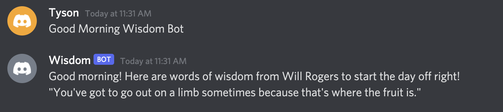

# Wisdom Bot
This bot was created to help inspire and motivate many of those who have lost their motivation. It attempts to help the users finds a purpose through words of wisdom from many different individuals who have had different life experiences.

### How Wisdom Bot Works?
Wisdom Bot uses webscraped quotes from brainyquote and randomly generates one when it sees one of the following things.

1. Using the command $wisdom on discord randomly generates a quote and the bot responds to the message with the quote

2. The bot automatically responds to variations of morning greetings on discord and provides a randomly generated quote for the individul to start off the day

### Packages Used

1. Requests: Used to get the information from brainyquote
2. Beautiful Soup: Used to look through the information that we requested and parse through the HTML to extract the wisdom quotes that we were looking for 
3. Pandas: Organized the quotes into a dataframe with two columns: quotes and authors. Also used to randomly generate a quote from the dataframe
4. Discord: Allows us to read messages that are being sent through the channel to look for keywords and respond to those keywords with randomly generated quotes from the dataframe